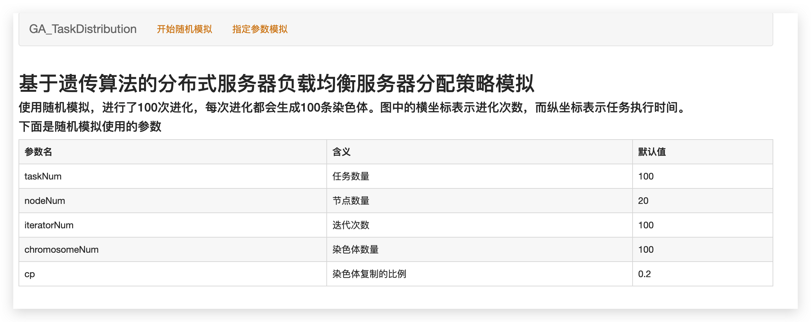
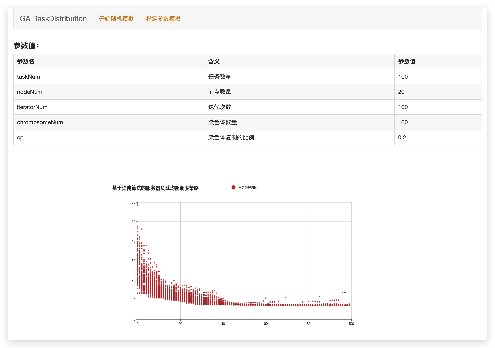
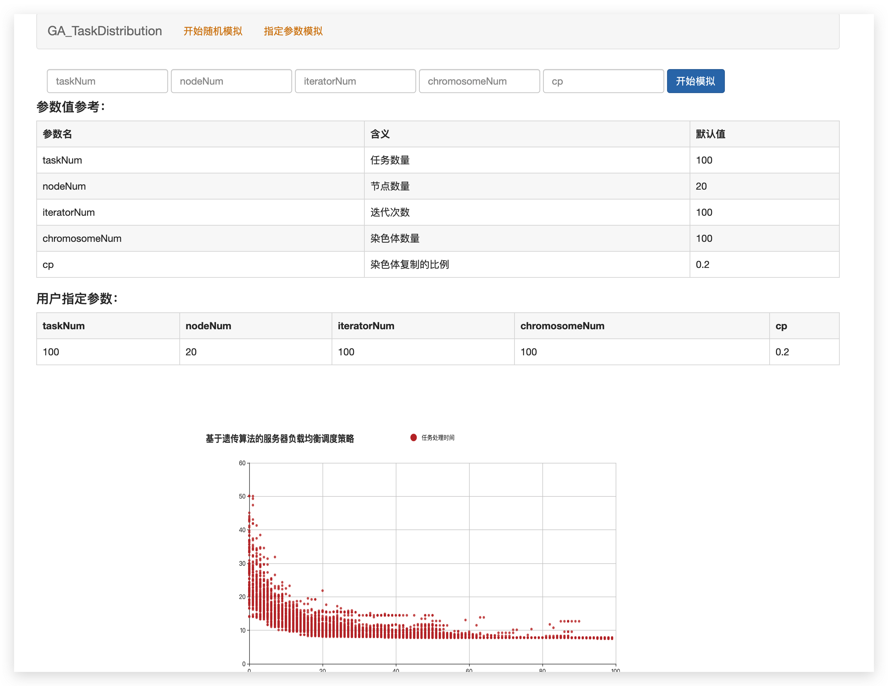

# 基于遗传算法的服务器资源分配模拟

> 背景：人工智能课程设计

## **项目目的**  

通过遗传算法实现对于多服务器负载均衡情况下的任务分配问题。  

通过代码实现遗传算法的过程，并模拟算法解决资源分配的过程，对于每一代的迭代结果都进行了可视化的展示，清晰的展示遗传算法的过程和效果。

## 说明

###   **任务分析**  

本项目为了解决如下问题：某负载均衡服务器系统存在n个节点，都有同样的处理速度，有某一批任务，设计一种合理的分配方式使得总时间花费最少。其中每个任务的任务长度、每台服务器节点的处理速度已知。  

### 数据分析

  所有任务用数组tasks表示，tasks数据类型是list，index为对应的任务id，value为任务长度。  将所有服务器节点的处理速度用数组nodes表示，一样的index表示nodeid，value也就是nodes[j]表示节点j的处理速度。  有了前两个的数据就可以求出时间矩阵timeMatrix，它是一个二维数组，timeMatrix[i][j]表示将任务i分配给节点j处理所需的时间，它通过如下公式计算：timeMatrix[i][j] = tasks[i]/nodes[j]。  每次进化都会产生N条染色体，每一条染色体都是当前问题的一个可行解，可行解由多个元素构成，每个元素称为染色体的一个基因，因此可以用一个染色体数组来记录算法每次进化过程中的可行解。一位数组的下标表示任务的编号，数组的值表示节点的编号。chromosome[i]=j的含义就是：将任务i分配给了节点j。  通过适应度函数计算每一条染色体的适应度，并保留适应度高的染色体、淘汰适应度差的染色体。所以有一个适应度矩阵，记录当前N条染色体的适应度。将N个任务执行总时长作为适应度评判的标准。当所有任务分配完后，如果总时长较长，那么适应度就越差；而总时长越短，则适应度越高。  

每次进化过程中，都需要根据适应度矩阵计算每一条染色体在下一次进化中被选择的概率。矩阵的下标表示染色体的编号，而矩阵中的值表示该染色体对应的选择概率。计算公式如下： selectionProbability[i] = adaptability[i] / 适应度之和。

## 截图

* 随机模拟

* 指定参数

